# Hi 👋, I'm Tanguturi B

**Computer Science Undergraduate (B.Tech CSE – 3rd Year)** · 🇮🇳 India

*Building a portfolio of 12 Python projects, one commit at a time.*

---

### 👨‍💻 About Me

- 🎓 B.Tech Computer Science Engineering student
- 💻 Passionate about programming and software development
- 🐍 Currently learning Python through real-world projects
- 📂 Building a portfolio of 12 Python projects
- 🌱 Continuously improving problem-solving skills
- 🚀 Exploring Git and GitHub
- 🎯 Aiming to become a Software Engineer

### 💡 Short Bio

Computer Science undergraduate passionate about Python development and building real-world projects. Currently focused on strengthening programming skills through practical projects while learning Git, GitHub, and modern software development practices.

---

### 📚 Currently Learning → 📖 Learning Next

| Currently Learning | Learning Next |
|---|---|
| Python | CSV |
| Git | Object-Oriented Programming (OOP) |
| GitHub | Exception Handling |
| Functions | SQLite |
| File Handling | APIs |
| JSON | Flask, Django |
| | Data Structures & Algorithms |

---

### 🛠 Languages & Tools

---

### 🚀 Projects

- 🎓 **Student Grade Calculator**
- 💰 **Expense Tracker**
- 📒 **Contact Book**

### 🎯 Goals

- [ ] Complete 12 Python projects
- [ ] Learn DSA
- [ ] Learn Full Stack Development
- [ ] Build a professional portfolio
- [ ] Secure a Software Engineering internship
- [ ] Contribute to open source

### 🎥 Hobbies & Interests

🏏 Cricket · 🎬 Creating cricket edit videos · 🎥 Learning video editing · 💻 Programming · 📚 Learning new technologies

---

### 📊 GitHub Stats

> The three widgets above render live automatically — no setup needed, just replace `tanguturi-b` if your username ever changes.

---

### 📈 Live Metrics Dashboard (isometric calendar, coding habits, languages)

<!--START_SECTION:metrics-->

<!--END_SECTION:metrics-->

> This section is generated by the `metrics.yml` workflow (lowlighter/metrics). Once the Action runs for the first time, it commits `metrics.svg` to this repo and the image above will render your real, live-updating dashboard — the closest possible match to the reference image, built from your actual GitHub activity.

---

🔥 *I believe in learning by building projects. Every completed project teaches me something new. Always learning, always building.*

